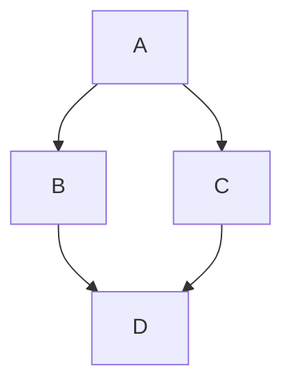

# Markdown与LaTeX语法完整指南

**标签：** #Markdown #LaTeX #工具

---

## 目录

1. [Markdown基础语法](#一markdown基础语法)
2. [Markdown扩展语法](#二markdown扩展语法)
3. [LaTeX数学公式](#三latex数学公式)
4. [常用符号速查表](#四常用符号速查表)

---

# 一、Markdown基础语法

## 1. 标题

使用 `#` 表示标题级别，共6级。`#` 后必须跟一个空格。

```markdown
# 一级标题
## 二级标题
### 三级标题
#### 四级标题
##### 五级标题
###### 六级标题
```

**替代语法**（Setext风格，仅支持1、2级）：

```markdown
一级标题
========

二级标题
--------
```

---

## 2. 段落与换行

- **段落**：连续两行文本之间用**空行**分隔
- **换行**（软换行）：在行末加**两个空格**然后回车

```markdown
这是第一段（末尾无空格）

这是第二段（上面有空行）

这是第一行（末尾有两个空格）  
这是第二行（紧接上一行软换行）
```

---

## 3. 强调（斜体/粗体）

| 样式 | 语法 | 示例 | 效果 |
|------|------|------|------|
| 斜体 | `*文字*` 或 `_文字_` | `*hello*` | *hello* |
| 粗体 | `**文字**` 或 `__文字__` | `**world**` | **world** |
| 粗斜体 | `***文字***` 或 `___文字___` | `***!!!***` | ***!!!*** |

> 建议使用 `*` 和 `**`，避免与下划线混淆。

---

## 4. 列表

### 4.1 无序列表

使用 `-`、`+` 或 `*` 作为标记，后跟空格。

```markdown
- 苹果
- 香蕉
- 橙子
```

### 4.2 有序列表

使用数字加点 `.`，数字不必连续，但建议从1开始。

```markdown
1. 第一项
2. 第二项
3. 第三项
```

### 4.3 嵌套列表

在子项前**缩进2或4个空格**（或一个Tab）。

```markdown
- 水果
  - 苹果
    - 红富士
  - 香蕉
- 蔬菜
  1. 胡萝卜
  2. 西兰花
```

### 4.4 任务列表（GFM扩展）

使用 `- [ ]` 表示未完成，`- [x]` 表示已完成。

```markdown
- [x] 完成作业
- [ ] 阅读书籍
- [ ] 写报告
```

---

## 5. 引用（块引用）

使用 `>` 标记，可嵌套。

```markdown
> 这是一段引用。
> 
> > 这是嵌套引用。
> 
> 回到外层引用。
```

---

## 6. 代码

### 6.1 行内代码

使用反引号 `` ` `` 包裹。

```markdown
使用 `printf()` 函数输出。
```

若代码中包含反引号，可使用双反引号包裹：

```markdown
`` `code` ``  →  `code`
```

### 6.2 代码块

#### 围栏式代码块（推荐）

使用三个反引号 ` ``` ` 或三个波浪线 `~~~` 包裹，可指定语言实现语法高亮。

```markdown
```python
def hello():
    print("Hello, world!")
```
```

#### 缩进式代码块

每行缩进4个空格或1个Tab。

> 围栏式更常用，且支持语法高亮。

---

## 7. 分隔线

使用三个或以上的 `-`、`*` 或 `_` 单独成行。建议在前后加空行。

```markdown
---
***
___
```

---

## 8. 链接

### 8.1 行内链接

```markdown
[文本](URL "可选标题")
```

示例：`[Google](https://www.google.com "搜索引擎")`

### 8.2 参考式链接

将链接定义为引用，便于复用。

```markdown
[文本] [标签]

[标签]: URL "可选标题"
```

### 8.3 自动链接

使用 `<URL>` 或 `<email@example.com>`。

```markdown
<https://example.com>
<user@example.com>
```

### 8.4 相对链接

在本地Markdown文件中可使用相对路径。

```markdown
[关于我们](./about.md)
[图片](../images/photo.jpg)
```

---

## 9. 图片

语法与链接类似，前面加 `!`。

```markdown

```

**带链接的图片**：

```markdown
[](点击跳转的URL)
```

---

## 10. 表格（GFM）

使用竖线 `|` 和短横 `-` 绘制表格。第二行使用 `|---|` 分隔表头和内容，冒号 `:` 控制对齐。

```markdown
| 左对齐 | 居中对齐 | 右对齐 |
|:-------|:--------:|-------:|
| 单元格1 | 单元格2  | 单元格3 |
| 单元格4 | 单元格5  | 单元格6 |
```

---

# 二、Markdown扩展语法

## 1. 脚注（扩展）

```markdown
这里需要解释一个概念 [^1]。

[^1]: 这是脚注内容，可以多行。
```

## 2. 定义列表（扩展）

```markdown
术语
: 定义内容，可多行。
```

## 3. 删除线（GFM）

使用两个波浪线 `~~` 包裹。

```markdown
~~删除的内容~~
```

## 4. 上下标（扩展）

```markdown
x^2^      % 上标
H~2~O     % 下标
```

> 更可靠的方式：使用LaTeX的 `$x^2$` 和 `$H_2O$`。

## 5. 高亮/标记（扩展）

```markdown
==需要高亮的内容==
```

## 6. 目录（TOC）

```markdown
[TOC]
```

## 7. 图表与流程图（Mermaid扩展）

```markdown

```

---

# 三、LaTeX数学公式

## 1. 行内公式与行间公式

### 行内公式

语法：`$...$`

```latex
$E = mc^2$
```

### 行间公式

语法：`$$...$$`

```latex
$$
E = mc^2
$$
```

### 行间公式（编号）

```latex
$$
\begin{equation} 
E=mc^2 
\end{equation}
$$
```

---

## 2. 希腊字母

| 名称 | 大写 | 代码 | 小写 | 代码 |
|------|------|------|------|------|
| Alpha | $A$ | `A` | $\alpha$ | `\alpha` |
| Beta | $B$ | `B` | $\beta$ | `\beta` |
| Gamma | $\Gamma$ | `\Gamma` | $\gamma$ | `\gamma` |
| Delta | $\Delta$ | `\Delta` | $\delta$ | `\delta` |
| Epsilon | $E$ | `E` | $\epsilon$ | `\epsilon` |
| Zeta | $Z$ | `Z` | $\zeta$ | `\zeta` |
| Eta | $H$ | `H` | $\eta$ | `\eta` |
| Theta | $\Theta$ | `\Theta` | $\theta$ | `\theta` |
| Iota | $I$ | `I` | $\iota$ | `\iota` |
| Kappa | $K$ | `K` | $\kappa$ | `\kappa` |
| Lambda | $\Lambda$ | `\Lambda` | $\lambda$ | `\lambda` |
| Mu | $M$ | `M` | $\mu$ | `\mu` |
| Nu | $N$ | `N` | $\nu$ | `\nu` |
| Xi | $\Xi$ | `\Xi` | $\xi$ | `\xi` |
| Pi | $\Pi$ | `\Pi` | $\pi$ | `\pi` |
| Rho | $P$ | `P` | $\rho$ | `\rho` |
| Sigma | $\Sigma$ | `\Sigma` | $\sigma$ | `\sigma` |
| Tau | $T$ | `T` | $\tau$ | `\tau` |
| Upsilon | $\Upsilon$ | `\Upsilon` | $\upsilon$ | `\upsilon` |
| Phi | $\Phi$ | `\Phi` | $\phi$ | `\phi` |
| Chi | $X$ | `X` | $\chi$ | `\chi` |
| Psi | $\Psi$ | `\Psi` | $\psi$ | `\psi` |
| Omega | $\Omega$ | `\Omega` | $\omega$ | `\omega` |

---

## 3. 常用数学符号

### 3.1 关系运算符

| 符号 | 代码 | 符号 | 代码 |
|------|------|------|------|
| $\leq$ | `\leq` | $\geq$ | `\geq` |
| $\neq$ | `\neq` | $\approx$ | `\approx` |
| $\equiv$ | `\equiv` | $\sim$ | `\sim` |
| $\propto$ | `\propto` | $\perp$ | `\perp` |

### 3.2 集合运算符

| 符号 | 代码 | 符号 | 代码 |
|------|------|------|------|
| $\in$ | `\in` | $\notin$ | `\notin` |
| $\subset$ | `\subset` | $\subseteq$ | `\subseteq` |
| $\cup$ | `\cup` | $\cap$ | `\cap` |
| $\emptyset$ | `\emptyset` | $\mathbb{R}$ | `\mathbb{R}` |

### 3.3 箭头

| 符号 | 代码 | 符号 | 代码 |
|------|------|------|------|
| $\leftarrow$ | `\leftarrow` | $\rightarrow$ | `\rightarrow` |
| $\Leftarrow$ | `\Leftarrow` | $\Rightarrow$ | `\Rightarrow` |
| $\leftrightarrow$ | `\leftrightarrow` | $\Leftrightarrow$ | `\Leftrightarrow` |
| $\uparrow$ | `\uparrow` | $\downarrow$ | `\downarrow` |

### 3.4 逻辑与其它

| 符号 | 代码 | 符号 | 代码 |
|------|------|------|------|
| $\forall$ | `\forall` | $\exists$ | `\exists` |
| $\therefore$ | `\therefore` | $\because$ | `\because` |
| $\partial$ | `\partial` | $\infty$ | `\infty` |
| $\nabla$ | `\nabla` | $\angle$ | `\angle` |
| $\pm$ | `\pm` | $\mp$ | `\mp` |
| $\cdot$ | `\cdot` | $\times$ | `\times` |
| $\div$ | `\div` | $\ast$ | `\ast` |

---

## 4. 上下标、根号、分式

| 功能 | 语法 | 示例 | 效果 |
|------|------|------|------|
| 上标 | `^{...}` | `x^{2}` | $x^{2}$ |
| 下标 | `_{...}` | `x_{i}` | $x_{i}$ |
| 平方根 | `\sqrt{...}` | `\sqrt{x+y}` | $\sqrt{x+y}$ |
| n次根号 | `\sqrt[n]{...}` | `\sqrt[3]{x}` | $\sqrt[3]{x}$ |
| 分式 | `\frac{...}{...}` | `\frac{a}{b}` | $\frac{a}{b}$ |

---

## 5. 大型运算符

### 求和

```latex
$\sum_{i=1}^{n} i$
```

### 累乘

```latex
$\prod_{i=1}^{n} i$
```

### 积分

```latex
$\int_{a}^{b} f(x)dx$
```

### 极限

```latex
$\lim_{x \to 0} \frac{\sin x}{x} = 1$
```

---

## 6. 矩阵与行列式

### 基本矩阵

```latex
$$
\begin{matrix}
a & b \\
c & d
\end{matrix}
$$
```

### 带括号的矩阵

| 环境 | 代码 | 效果 |
|------|------|------|
| 圆括号 | `pmatrix` | $\begin{pmatrix} a & b \\ c & d \end{pmatrix}$ |
| 方括号 | `bmatrix` | $\begin{bmatrix} a & b \\ c & d \end{bmatrix}$ |
| 花括号 | `Bmatrix` | $\begin{Bmatrix} a & b \\ c & d \end{Bmatrix}$ |
| 竖线 | `vmatrix` | $\begin{vmatrix} a & b \\ c & d \end{vmatrix}$ |

---

## 7. 多行公式

### align环境（等号对齐）

```latex
$$
\begin{align}
x &= a + b \\
y &= c + d + e + f \\
z &= g + h
\end{align}
$$
```

### cases环境（分段函数）

```latex
$$
f(x) = 
\begin{cases}
x^2, & \text{if } x \ge 0 \\
-x^2, & \text{if } x < 0
\end{cases}
$$
```

---

## 8. 函数与操作符

| 函数 | 代码 | 效果 | 函数 | 代码 | 效果 |
|------|------|------|------|------|------|
| 正弦 | `\sin` | $\sin$ | 余弦 | `\cos` | $\cos$ |
| 正切 | `\tan` | $\tan$ | 对数 | `\log` | $\log$ |
| 自然对数 | `\ln` | $\ln$ | 指数 | `\exp` | $\exp$ |
| 最大值 | `\max` | $\max$ | 最小值 | `\min` | $\min$ |
| 极限 | `\lim` | $\lim$ | 上确界 | `\sup` | $\sup$ |

---

## 9. 字体与黑板体

| 效果 | 代码 | 示例 |
|------|------|------|
| 罗马体 | `\mathrm{...}` | $\mathrm{ABC}$ |
| 粗体 | `\mathbf{...}` | $\mathbf{ABC}$ |
| 黑板粗体 | `\mathbb{...}` | $\mathbb{R, C, Q, Z, N}$ |
| 花体 | `\mathcal{...}` | $\mathcal{ABCDEF}$ |

---

## 10. 复杂公式示例

### 欧拉公式

```latex
$$
e^{i\theta} = \cos\theta + i\sin\theta
$$
```

### 正态分布概率密度函数

```latex
$$
f(x) = \frac{1}{\sigma\sqrt{2\pi}} \, e^{-\frac{(x-\mu)^2}{2\sigma^2}}
$$
```

---

# 四、常用符号速查表

| 元素 | 语法 |
|------|------|
| 标题 | `# H1` ... `###### H6` |
| 粗体 | `**bold**` |
| 斜体 | `*italic*` |
| 删除线 | `~~strikethrough~~` |
| 无序列表 | `- item` |
| 有序列表 | `1. item` |
| 任务列表 | `- [ ] todo` |
| 引用 | `> quote` |
| 行内代码 | `` `code` `` |
| 代码块 | ` ```lang ` |
| 链接 | `[text](url)` |
| 图片 | `` |
| 表格 | `\| a \| b \|` |
| 分隔线 | `---` |
| 脚注 | `[^1]` + `[^1]: text` |
| 数学 | `$...$` / `$$...$$` |

---

# 五、最佳实践

1. **统一风格**：列表用 `-`，粗体用 `**`，代码块用围栏式
2. **空行分隔**：段落、列表、表格、代码块前后建议加空行
3. **不依赖扩展**：若需要在GitHub等通用平台使用，优先使用标准语法 + GFM
4. **预览测试**：不同渲染器可能存在差异，发布前预览

---

**参考资源**：
- [CommonMark规范](https://commonmark.org/)
- [GitHub Flavored Markdown](https://github.github.com/gfm/)
- [MathJax文档](https://www.mathjax.org/)
